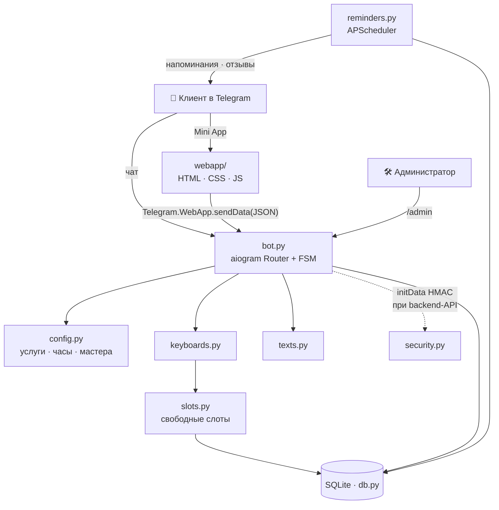
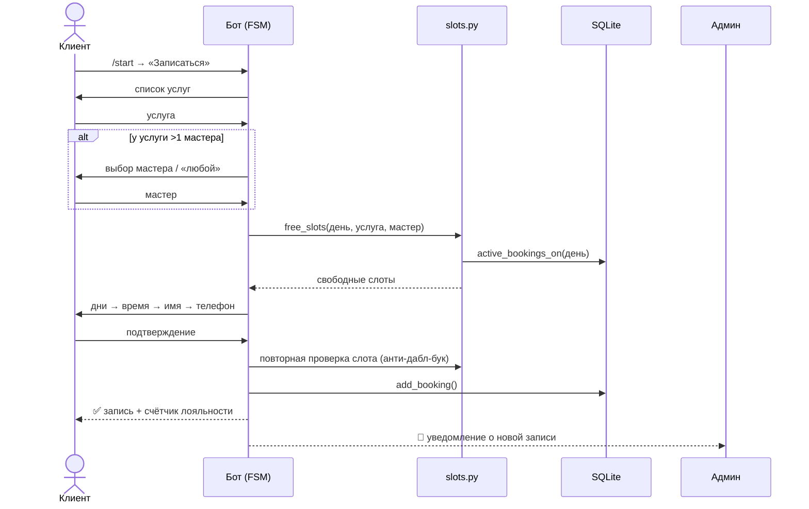
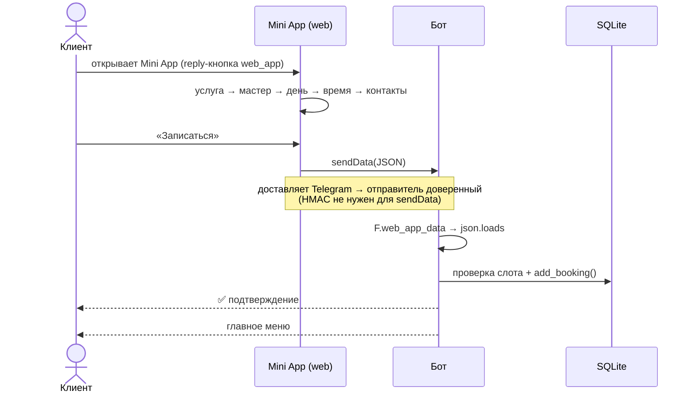
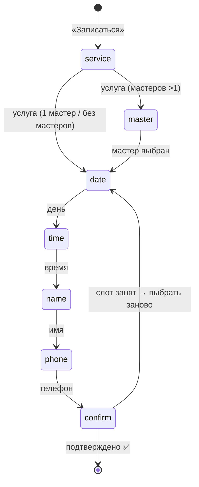
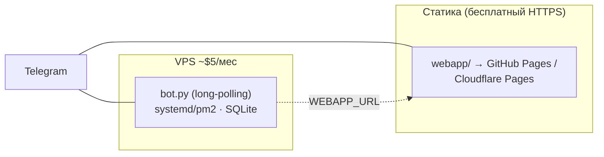

# 🏗 Архитектура · Бот онлайн-записи + Telegram Mini App

Документ для клиента/портфолио: как устроена система, как идут данные, где проверяется занятость, как разворачивать. Диаграммы — Mermaid (рендерятся на GitHub и в большинстве просмотрщиков Markdown).

## Скриншоты интерфейса (Mini App)

Реальные экраны мини-приложения (снято в предпросмотре, тема Telegram):

1. **Выбор услуги** → 2. **Выбор мастера** → 3. **Дата и время** → 4. **Контакты и подтверждение**. Прогресс-бар, подсветка выбора, авто-тема Telegram (светлая/тёмная).

## Компоненты

| Модуль | Ответственность |
|---|---|
| `bot.py` | Точка входа, `Dispatcher`/`Router`, FSM-сценарий записи, переносы, оценки, админка, приём данных из Mini App |
| `config.py` | Настройки бизнеса: услуги, цены, часы, рабочие дни, мастера, лояльность, `WEBAPP_URL` |
| `slots.py` | Чистая логика расписания: сетка времени, свободные слоты с учётом ёмкости мастеров (без зависимостей от Telegram → тестируется) |
| `db.py` | SQLite: записи, занятость, отмена/перенос, оценки, агрегаты для статистики; мягкая миграция схемы |
| `keyboards.py` | Inline/Reply-клавиатуры, кнопка запуска Mini App (`web_app`) |
| `texts.py` | Все тексты сообщений (легко менять тон/язык) |
| `reminders.py` | Фоновые задачи (APScheduler): напоминания до визита, запрос оценки после |
| `security.py` | Валидация `initData` (HMAC-SHA256) — на случай backend-API Mini App |
| `webapp/` | Telegram Mini App: `index.html`, `style.css`, `app.js` (статика, HTTPS) |

## Поток записи через чат

## Поток записи через Mini App

## Конечный автомат записи (FSM)

## Модель данных (таблица `bookings`)

| Поле | Тип | Назначение |
|---|---|---|
| `id` | INTEGER PK | номер записи |
| `user_id` | INTEGER | Telegram ID клиента |
| `username` | TEXT | @username (если есть) |
| `client_name` | TEXT | имя |
| `phone` | TEXT | телефон |
| `service_id` | TEXT | услуга (из config) |
| `master_id` | TEXT | мастер (или NULL = «любой/без мастера») |
| `slot` | TEXT | ISO `YYYY-MM-DDTHH:MM` — начало визита |
| `created_at` | TEXT | когда создана |
| `status` | TEXT | `active` / `cancelled` |
| `reminded` | INTEGER | напоминание отправлено |
| `rating` | INTEGER | оценка 1–5 после визита |
| `feedback` | TEXT | текстовый отзыв |
| `feedback_asked` | INTEGER | запрос оценки отправлен |

## Где проверяется занятость (важно)

Источник правды о свободных слотах — **бэкенд бота** (`slots.free_slots`, данные из SQLite). Mini App не имеет прямого доступа к БД: он показывает сетку и отправляет выбор через `sendData`, а **бот при приёме повторно проверяет слот** и при конфликте отклоняет. Это исключает двойную бронь даже если двое выбрали одно время одновременно.

> Апгрейд: если нужен «живой» календарь занятости в Mini App — добавляется лёгкий read-API (`/free?date=&service=`), который вызывает ту же `slots.free_slots`; запросы из Mini App тогда подписываются `initData` и проверяются `security.validate_init_data` (это backend-сценарий, см. `security.py`).

## Развёртывание

- **Бот:** маленький VPS, запуск `python bot.py` под `systemd`/`pm2` (long-polling — вебхук/домен не нужен). SQLite-файл рядом.
- **Mini App:** статика на GitHub Pages или Cloudflare Pages (бесплатный HTTPS — обязателен для Telegram). URL прописывается в `.env` как `WEBAPP_URL`; бот показывает кнопку запуска.
- **Масштаб:** SQLite держит тысячи записей; при росте — Postgres (заменить только `db.py`).

> Реализация и запуск — в [README.md](README.md). Стратегия услуг — в `../../games-project/24_грузия_вывод_детально.md`.
