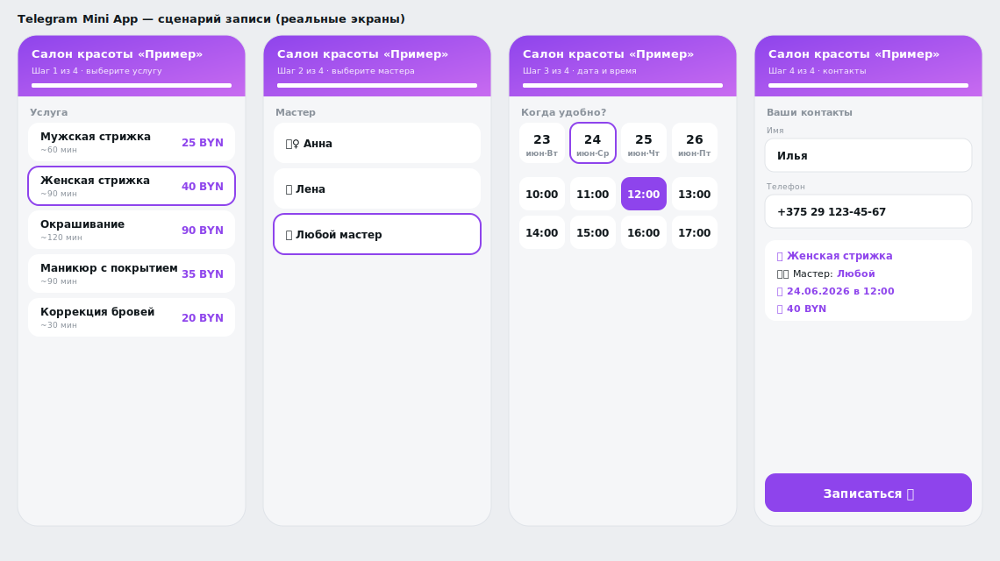

# Telegram Booking Bot + Mini App

A self-service appointment-booking bot for a salon / barbershop / studio / cafe. Clients book in ~30 seconds — either **inside the Telegram chat** or through a visual **Telegram Mini App**. The admin gets instant notifications; the client gets reminders and a post-visit rating request.

> The in-app UI is intentionally **in Russian** (the bot targets Russian-speaking clients). This README is in English for developers.

**Tech stack:** Python · [`aiogram 3.x`](https://docs.aiogram.dev/) (async) · SQLite · APScheduler · Telegram Mini App (vanilla HTML/CSS/JS). No paid services required. Architecture and data-flow diagrams live in [ARCHITECTURE.md](ARCHITECTURE.md).



## What it does

**For the client**
- Chat-based booking flow: service -> master -> day -> free time -> name -> phone -> confirm.
- **Telegram Mini App** — the same flow in a polished visual UI (auto Telegram theme, progress bar, native main button).
- Pick a master (or "any"); free slots are computed from master load.
- "My bookings": **reschedule** and cancel.
- Automatic reminder before the visit.
- Post-visit rating request (1–5) + optional comment.
- Loyalty counter (bonus every Nth visit).

**For the admin** (`/admin`)
- List of upcoming bookings + cancel (the client is notified).
- Stats: bookings today / last 7 days, revenue forecast, top service, average rating.
- Broadcast / promo message to all clients.
- Instant notification on every new booking.

**Under the hood**
- Double-booking protection (the slot is re-checked on the backend before saving).
- The time grid is built from working hours/days; busy and past slots are hidden.
- Everything (services, prices, hours, masters, loyalty) is configured in [config.py](config.py) — no code edits needed.

## Architecture at a glance

This repo runs as **two independent pieces**:

1. **The bot** — a long-running Python **process** (`python bot.py`). It owns the SQLite database, the booking logic, reminders, and the admin panel. This is *not* a website and does *not* belong on GitHub Pages.
2. **The Mini App** — the `webapp/` folder is a **static site** (`index.html` + `style.css` + `app.js`). It is the only part that gets hosted on a static host (GitHub Pages / Cloudflare Pages). Data flows back to the bot via `Telegram.WebApp.sendData` (handled by `F.web_app_data` in [bot.py](bot.py)).

## Run the bot (local or VPS)

Requires **Python 3.11–3.12** (3.14-alpha may fail to build some dependencies).

1. Create a bot token: in Telegram open **@BotFather** -> `/newbot` -> copy the token.
2. Get your Telegram user ID from **@userinfobot** (this becomes `ADMIN_IDS`).
3. From the project root, create a virtual environment, install deps, and copy the env template:

   **Linux / macOS (VPS):**
   ```bash
   python3 -m venv .venv
   source .venv/bin/activate
   pip install -r requirements.txt
   cp .env.example .env
   ```

   **Windows (PowerShell):**
   ```powershell
   python -m venv .venv
   .\.venv\Scripts\Activate.ps1
   pip install -r requirements.txt
   copy .env.example .env
   ```

4. Edit `.env` and set at minimum:
   ```ini
   BOT_TOKEN=123456:your-token-here
   ADMIN_IDS=111111111        # your Telegram ID; comma-separated for multiple admins
   ```
   (`WEBAPP_URL` can stay empty for now — see the next section.)

5. Start the process:
   ```bash
   python bot.py
   ```
   Then open the bot in Telegram and press **/start**.

The SQLite database (`bookings.db`) is created automatically next to the code on first run.

### Keeping it running on a VPS

For production, run `python bot.py` under a process manager so it restarts on crash/reboot — e.g. a `systemd` service, `pm2`, `supervisor`, or `tmux`/`screen` for a quick test. Activate the venv (or point the unit at `.venv/bin/python`) and keep the `.env` file alongside the code.

### Optional: verify the logic without Telegram

```bash
python tests_smoke.py
```
Exercises the schedule, master capacity, the "any master" assignment, and DB aggregates against a temporary database.

## Deploy the Mini App (`webapp/`)

Telegram requires the Mini App to be served over **HTTPS**. The `webapp/` folder is fully static, so any static host works. Two free options:

### Option A — Cloudflare Pages (recommended for this layout)

Because the bot lives at the repo root, the Mini App is in a subfolder. Cloudflare Pages lets you point directly at it without moving any files:

1. Connect the GitHub repo in the Cloudflare Pages dashboard.
2. Build settings: **Build command:** *(leave empty)* · **Build output directory:** `webapp`.
3. Deploy — you'll get a URL like `https://your-project.pages.dev`.

### Option B — GitHub Pages

GitHub Pages only serves from the **repo root** or a **`/docs`** folder — it cannot serve directly from `webapp/`. So copy the Mini App into `/docs`:

```bash
# Linux / macOS
mkdir -p docs && cp -r webapp/* docs/
```
```powershell
# Windows (PowerShell)
New-Item -ItemType Directory -Force docs; Copy-Item webapp\* docs\ -Recurse -Force
```

Then in the repo: **Settings -> Pages -> Source: "Deploy from a branch", Branch: `main` / `/docs`**. Your URL will be `https://<user>.github.io/<repo>/`.

> If you go this route, re-copy `webapp/` -> `docs/` whenever you change the Mini App, so the two stay in sync. (Cloudflare Pages avoids this duplication.)

### Wire the URL back to the bot

Once you have the HTTPS URL, set it in `.env` and restart the bot:
```ini
WEBAPP_URL=https://your-project.pages.dev
```
A **"Записаться в приложении"** ("Book in the app") button now appears under the bot's welcome message.

> Keep the app's data (services / masters / hours) in `webapp/app.js` in sync with `config.py`.

## Project layout

| File / folder | Purpose |
|---|---|
| `bot.py` | Handlers, FSM, reschedule, ratings, admin panel, Mini App intake |
| `config.py` | Services, prices, hours, days, masters, loyalty, `WEBAPP_URL` |
| `slots.py` | Pure free-slot logic (unit-testable) |
| `db.py` | SQLite + schema migration |
| `keyboards.py` / `texts.py` | Keyboards / message texts |
| `reminders.py` | Reminders + post-visit rating (APScheduler) |
| `security.py` | `initData` validation (for the Mini App backend API) |
| `webapp/` | Telegram Mini App (`index.html`, `style.css`, `app.js`) — the static part |
| `ARCHITECTURE.md` | Diagrams, data flows, deployment notes |
| `.env.example` | Template for `.env` (copy and fill in) |

## License / usage

Portfolio demo project. Configure your own `BOT_TOKEN`, business details, services, and masters before using it in production.
